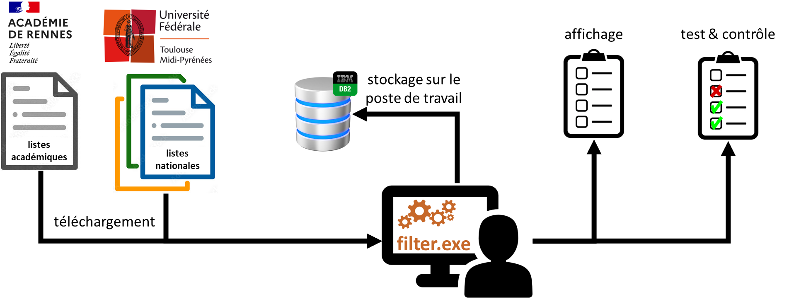

# ac-rennes-eple-filter

ac-rennes-eple-filter est un outil de l'Académie de Rennes permettant des opérations liées au filtrage web en EPLE mis en œuvre par l'Académie et les collectivités, dans le cadre de la protection des mineur·es.

L’outil a été conçu pour faciliter l’assistance sur le filtrage en EPLE, il permet :
- en assistance de niveau 1, aux personnels de la plateforme AMIGO de rapidement déterminer si un problème soumis est véritablement un problème de filtrage ;
- en assistance de niveau 2, aux personnels de la CSN de simuler le comportement des pare-feu pour mettre au point et ajuster la politique académique de filtrage ;
- éventuellement en assistance de niveau 3, de repérer d’éventuelles incohérences entre la politique attendue et celles mises en place.

## Fonctionnement général



## Installation

### Prérequis

- Un poste de travail sous Windows (le programme est fourni sous forme d’un exécutable compilé).

### Programme

- Télécharger [la dernière version du programme](https://github.com/pascalaubry/ac-rennes-eple-filter/releases) ;
- Décompresser l’archive dans le répertoire de votre choix.

## Configuration

### Accès à la base de données

L’accès à la base de données se configure dans le fichier de configuration [`database.yml`](database.yml), au format YAML :

```
file: ac_rennes_eple_filter.db
```

### Politique de filtrage

La politique de filtrage académique est décrite dans le fichier de configuration [`policy.yml`](policy.yml), également au format YAML (par défaut la configuration fournie est celle correspondant à la politique académique en cours) :

```
rules:
  -
    category: blacklist-CLG-LYC-PERS
    description: Sites bloqués par la politique académique pour tous les utilisateur.trice.s
    auth:
      all: deny
[...]
  -
    category: webmail
    description: Messagerie sur internet (hotmail, etc.)
```

### Proxy (≥ 1.4)

La configuration du proxy utilisé pour les téléchargements est indiquée dans le fichier de configuration [`proxy.yml`](proxy.yml), également au format YAML.

#### Appui sur la configuration définie au niveau système

```
type: system
```

#### Connexion directe

```
type: direct
```

#### Proxy pac

```
type: pac
pac_url: http://proxy.in.ac-rennes.fr/proxy.pac
```

#### Configuration manuelle

```
type: manual
proxies:
  http: educ-cd35-lbprx.colleges35.local:3128
  https: educ-cd35-lbprx.colleges35.local:3128
```

## Utilisation

### Syntaxe (`--help`)

```
$> ac-rennes-eple-filter x.y.z Copyright (c) 2022-2024 Région académique Bretagne
usage: ac_rennes_eple_filter.py [-h] [--update] [--policy] [--check URLS]
                                [--search PATTERN] [--control PROFILE]
                                [--optimize]

options:
  -h, --help         show this help message and exit
  --update           update the database
  --policy           print the policy rules
  --check URLS       test URLs or domains
  --search PATTERN   search for a pattern
  --control PROFILE  control the policy
  --optimize         optimize local rules
```

### Mise à jour des listes de filtrage (`--update`)

Les listes de filtrage sont téléchargées depuis le rectorat (listes maintenues par l’Académie) et l’université de Toulouse (listes du référentiel CARINE). 

La mise à jour des listes (téléchargement puis stockage dans la base de données) prend entre quelques minutes et quelques dizaines de minutes.

```
$> ac_rennes_eple_filter-x.y.z.exe --update
ac-rennes-eple-filter x.y.z Copyright (c) 2022-2024 Région académique Bretagne
Reading proxy config... OK
Initializing database... OK
Opening database connection sqlite://ac_rennes_eple_filter.db... ac_rennes_eple_filter.db not found, file will be created
Creating tables... OK
Loading policy... Loaded 68 rules.
Analyzing the database... Database is empty
Database is empty, updating...
Initializing web engine... OK
Downloading...
Downloading origin rennes...
Downloading category whitelist-BYPASS-AUTH... >> https://www.toutatice.fr/toutatice-portail-cms-nuxeo/binary/whitelist-BYPASS-AUTH.txt 200 OK
[...]
Downloading category whitelist-PERS... >> https://www.toutatice.fr/toutatice-portail-cms-nuxeo/binary/whitelist-PERS.txt 200 OK
Downloaded origin rennes.
Downloading origin toulouse...
Downloading category adult... 200 OK
Extracting adult.tar.gz... OK
[...]
Extracting webmail.tar.gz... OK
Downloaded origin toulouse.
All downloads succeeded.
Resetting the database... OK
Filling the database...
Storing category whitelist-BYPASS-AUTH... 20 domains added in 0 seconds
[...]
Storing category whitelist-PERS... 0 domains added in 0 seconds
Storing category adult................................................ 4514951 domains added in 21 seconds
[...]
Storing category webmail... 402 domains added in 0 seconds
5107406 total entries stored.
Reloading policy... Loaded 68 rules.
Analyzing the database... Found 66 categories and 5107406 domains.
```

> [!NOTE]
> Les listes ne sont téléchargées que si elles ont été mises à jour sur les sites de référence.

### Affichage de la politique (`--policy`)

```
$> ac_rennes_eple_filter-x.y.z.exe --policy
ac-rennes-eple-filter x.y.z Copyright (c) 2022-2024 Région académique Bretagne
Reading proxy config... OK
Initializing database... OK
Opening database connection sqlite://ac_rennes_eple_filter.db... OK
Loading policy... Loaded 68 rules.
Analyzing the database... Found 66 categories and 5107934 domains.
Writing HTML file [reports\policy-x.y.z.html]... OK
```

Le [fichier au format HTML](docs/policy-1.7.1.html) créé permet de visualiser la politique de filtrage et la partager.

### Test de la politique sur une URL (`--check`)

Le test d'une URL permet de savoir la réponse attendue des pare-feu des EPLE en respect de la politique de filtrage.

```
$> ac_rennes_eple_filter-x.y.z.exe --check https://www.credit-agricole.fr
ac-rennes-eple-filter x.y.z Copyright (c) 2022-2024 Région académique Bretagne
Reading proxy config... OK
Initializing database... OK
Opening database connection sqlite://ac_rennes_eple_filter.db... OK
Loading policy... Loaded 68 rules.
Analyzing the database... Found 66 categories and 5107406 domains.
Checking domain credit-agricole.fr...
Domains searched: credit-agricole.fr, fr
Found domain credit-agricole.fr in category bank
Found domain credit-agricole.fr in category liste_bu
Writing HTML file [reports\check-x.y.z-credit-agricole.fr-AAAAMMJJ.html]... OK
```

Le [fichier au format HTML](docs/check-1.7.1-credit-agricole.fr-20240122.html) créé permet de visualiser l'application de la politique de filtrage sur le domaine choisi et la partager.

### Recherche dans la base de données (`--search`)

Il peut parfois être utile de chercher un motif dans la base de données pour comprendre pourquoi une URL est autorisée ou interdite.

```
$> ac_rennes_eple_filter-x.y.z.exe --search agricole
ac-rennes-eple-filter x.y.z Copyright (c) 2022-2024 Région académique Bretagne
Reading proxy config... OK
Initializing database... OK
Opening database connection sqlite://ac_rennes_eple_filter.db... OK
Loading policy... Loaded 68 rules.
Analyzing the database... Found 66 categories and 5107406 domains.
Searching pattern agricole...
Total domains for pattern agricole: 160
Writing HTML file [reports\search-x.y.z-agricole-AAAAMMJJ.html]... OK
```

Les occurrences du motif dans la base de données sont consultables dans le [fichier au format HTML](docs/search-1.7.1-agricole-20240122.html) créé par l'application.

### Contrôle de la conformité de la mise en œuvre de la politique de filtrage (`--control`)

Cette fonctionnalité permet de contrôler la manière dont est mise en œuvre la politique de filtrage dans les EPLE.

Le paramètre de l'option `--control` permet d'indiquer le profil de l'utilisateur connecté :
- `per` = Personnels
- `lyc` = Lycéen·nes
- `clg` = Collégien·nes

#### Chargement du programme

```
$> ac_rennes_eple_filter-x.y.exe --control per
ac-rennes-eple-filter x.y Copyright (c) 2022-2023 Région académique Bretagne
ac-rennes-eple-filter x.y.z Copyright (c) 2022-2024 Région académique Bretagne
Reading proxy config... OK
Initializing database... OK
Opening database connection sqlite://ac_rennes_eple_filter.db... OK
Loading policy... Loaded 68 rules.
Analyzing the database... Found 66 categories and 5107406 domains.
Initializing web engine... OK
Hostname:   M099-PWL-MDT002
Private IP: 172.16.114.1
Retrieving public IP... 200
Public IP:  195.221.66.155
```

#### Construction des données de contrôle

Les données de contrôle sont construites automatiquement (les domaines sont tirés au sort dans les catégories de la politique de filtrage).

Les données de contrôle périment au bout de 48h et sont reconstruites automatiquement.

La construction des données de contrôle prend quelques minutes.

```
Looking for ac_rennes_eple_filter_expected_results.json... file not found.
Building policy expected results...
Adding last 20 domains of category whitelist-BYPASS-AUTH... icloud-content.com (1) [...] apple.com (10)
Adding last 20 domains of category blacklist-CLG-LYC-PERS... unblockedgames007.com (1) [...] jopi.com (20)
[...]
Category whitelist-PERS not found in database.
Picking last 5 domains of category liste_blanche... wrds-www.wharton.upenn.edu (1) [...] shom.fr (5)
[...]
Picking last 5 domains of category shopping... zzounds.com (1) [...] onestepahead.com (5)
```

#### Application de la politique académique sur les données de contrôle

La politique académique est évaluée sur les domaines précédemment tirés au sort pour tous les profils (personnels, lycéen·nes et collégien·nes).

```
Getting policy on domain icloud-content.com... allowed/allowed/allowed
[...]
Getting policy on domain onestepahead.com... denied/allowed/allowed
Writing ac_rennes_eple_filter_expected_results.json... OK
```

#### Vérification de la mise en œuvre de la politique académique

L'accès aux domaines est vérifié en HTTP et HTTPS puis comparé aux résultats attendus.

```
Reading ac_rennes_eple_filter_expected_results.json... 244 domains read.
[00%] [ETA: --:--] Testing http://icloud-content.com/ >> https://developer.apple.com/icloud/ 200 Allowed OK (1.12)
[...]
[50%] [ETA: 03:58] Testing https://clemobile.com/ SSLError Trying https://www.clemobile.com/ SSLError SSL error (0.32)
[50%] [ETA: 03:57] Testing http://mobiles-actus.com/ 202 Blocked by Stormshield (Blocage) Denied OK (0.21)
[51%] [ETA: 03:55] Testing https://mobiles-actus.com/ 202 Blocked by Stormshield (SSL error: The SSL server does not match the requested name) Trying https://www.mobiles-actus.com/ 202 Blocked by Stormshield (SSL error: The SSL server does not match the requested name) SSL error (0.40)
[...]
[99%] [ETA: 00:03] Testing http://onestepahead.com/ >> http://www.wards.com:80:80/cm/onestepahead.html >> https://www.wards.com/cm/onestepahead.html 200 Allowed OK (1.72)
[99%] [ETA: 00:02] Testing https://onestepahead.com/ SSLError Trying https://www.onestepahead.com/ SSLError SSL error (0.43)
Time spent: 08:57
Writing HTML file [reports\control-x.y.z-PER-IP-AAAAMMJJ-system.html]... OK
```
Le fichier au format HTML créé permet de visualiser la conformité de la mise en œuvre de la politique de filtrage et la partager.

Exemple de fichiers produits :
- [Exemple n°1](docs/control-1.7.1-PER-195.221.66.155-20240122-system.html) (conformité parfaite)
- [Exemple n°2](docs/control-1.7.1-CLG-79.95.87.134-20240122-system.html) (absence de filtrage)

### Optimisation des listes de l'Académie

Cette fonctionnalité permet de contrôler la non-redondance des listes locales de l'Académie avec celles de Toulouse, pour en faciliter la maintenance.

```
$> ac_rennes_eple_filter-x.y.z.exe --optimize
ac-rennes-eple-filter x.y Copyright (c) 2022-2023 Région académique Bretagne
Reading proxy config... OK
Initializing database... OK
Opening database connection sqlite://ac_rennes_eple_filter.db... OK
Loading policy... Loaded 66 rules.
Analyzing the database... Found 66 categories and 5107406 domains.
Verifying category blacklist-CLG-LYC-PERS...
### Domain apple.com is useless: Access already denied (domain apple.com matches category whitelist-PERS-LYC-CLG)
[...]
### Domain networking.apple is useless: Access already allowed (by default)
19 useless domains found.
Reading cache\download\rennes\whitelist-BYPASS-AUTH.txt... Read 28 lines.
Wrote reports\whitelist-BYPASS-AUTH-optimized.txt.
[...]
Verifying category whitelist-PERS...
File download\rennes\whitelist-PERS.txt already optimized.
```

### Mode interactif

Lancé sans paramètre, le programme propose un mode interactif permettant d'accéder à toutes les fonctionnalités précédentes.

```
$> ac_rennes_eple_filter-x.y.z.exe
ac-rennes-eple-filter x.y.z Copyright (c) 2022-2024 Région académique Bretagne
Reading proxy config... OK
Initializing database... OK
Opening database connection sqlite://ac_rennes_eple_filter.db... OK
Loading policy... Loaded 68 rules.
Analyzing the database... Found 66 categories and 5107406 domains.
What do you want to do?
- [U]pdate the database
- [P]rint the policy
- [T]est URLs or domains
- [S]earch a pattern in the database
- [C]ontrol the policy
- [O]ptimize local rules
- [Q]uit
Your choice: 
```

## Historique

| Date             | Version | Auteur·ice   | Modifications                                                                                                                    |
|------------------|---------|--------------|----------------------------------------------------------------------------------------------------------------------------------|
| 12 janvier 2024  | 1.7     | Pascal AUBRY | Correction d'un bug WHOIS<br/>Prise en charge du filtrage Stormshield de l'Académie<br/>Prise en charge du filtrage Squid du SIB |
| 20 décembre 2023 | 1.6     | Pascal AUBRY | Prise en charge du filtrage Artica du SIB                                                                                        |
| 10 octobre 2023  | 1.5     | Pascal AUBRY | Stockage DB2                                                                                                                     |
| 21 mars 2023     | 1.4     | Pascal AUBRY | Ajout du fichier de configuration proxy.yml                                                                                      |
| 13 décembre 2022 | 1.3     | Pascal AUBRY | Optimisation des téléchargements                                                                                                 |
| 9 décembre 2022  | 1.2     | Pascal AUBRY | Amélioration de la gestion des erreurs                                                                                           |
| 5 décembre 2022  | 1.1     | Pascal AUBRY | Création automatique de la base de données au premier lancement                                                                  |
| 2 décembre 2022  | 1.0     | Pascal AUBRY | Version initiale                                                                                                                 |
